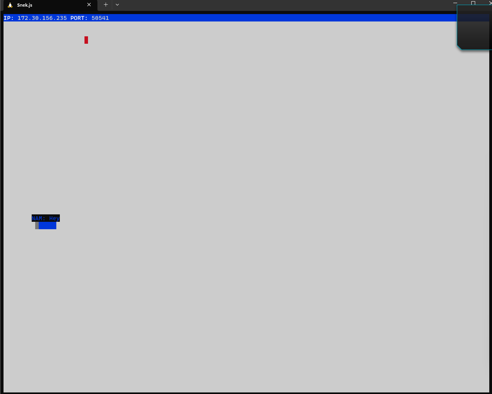
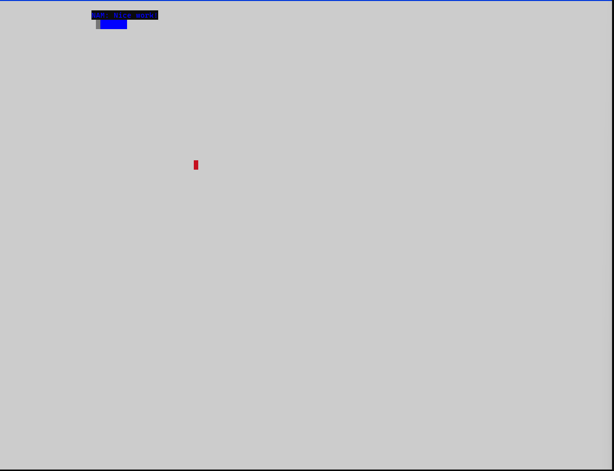
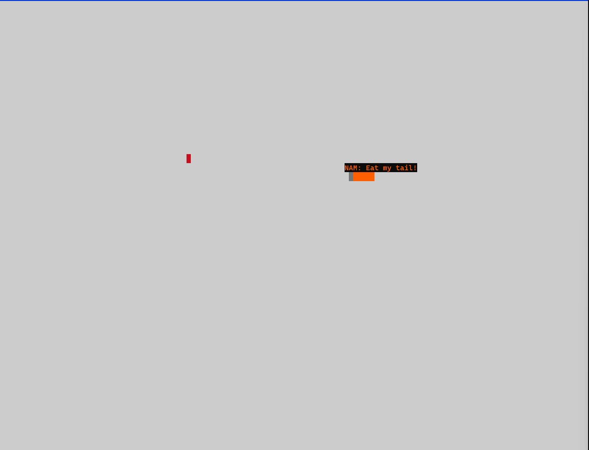

# Snake Client Project

My Snake Client repo and code that runs over the network. Made based off of the project for Lighthouse Labs Web Flex Bootcamp

## Installation

Before you can run the client, you will need to be running the server side which you can download and install from 

```
git clone https://github.com/nicoayamen/snek-multiplayer.git
cd snek-multiplayer
npm install
```

## Getting Started
- Clone my snake-client
```
git clone https://github.com/nicoayamen/snake-client.git
cd snake-client
```
- Run the server first in a seperate terminal instance.
```
cd snek-multiplayer
npm run play
```
- Run the snake client using the `node play.js` command within the `snake-client` directory in a second terminal instance.
- Lastly, and most importantly, have fun!

## Usage
- WASD is used to move around the game world. (W = up, S = down, A = left, D = right)
- Hold down a key to move faster!
- Get your snake to the red boxes to grow and avoid yourself and the wall
- Should your snake hit the wall or itself, its game over!
- Want to chat? Press Z, X, C, or V for a quick message to be broadcasted!
- To replay, run `node play.js` again inside for you play terminal instance

## Final Product




## Special Thanks
Thank you to to Lighthouse Labs and <a href ="https://www.taniarascia.com" target="_blank">Tania Rascia</a> for creating the server code to run my client side code!
